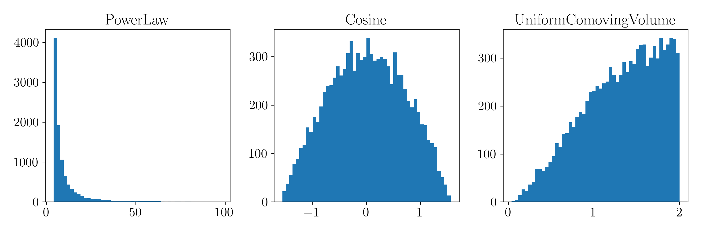

Distributions
================

Sample from probability distributions not yet included in `torch.distributions`.

.. code-block:: python

   from ml4gw.distributions import PowerLaw, Cosine, UniformComovingVolume
   import matplotlib.pyplot as plt

   # Initialize distributions
   power_law = PowerLaw(
      minimum=4,
      maximum=100,
      index=-3,
   )
   cosine = Cosine()
   ucv = UniformComovingVolume(
      minimum=0,
      maximum=2,
      distance_type="redshift",
   )

   # Sample from distributions
   samples_power_law = power_law.sample((10000,))
   samples_cosine = cosine.sample((10000,))
   samples_ucv = ucv.sample((10000,))

   # Plot samples
   plt.figure(figsize=(12, 4))

   plt.subplot(1, 3, 1)
   plt.hist(samples_power_law, bins=50)
   plt.title("PowerLaw")

   plt.subplot(1, 3, 2)
   plt.hist(samples_cosine, bins=50)
   plt.title("Cosine")

   plt.subplot(1, 3, 3)
   plt.hist(samples_ucv, bins=50)
   plt.title("UniformComovingVolume")

   plt.tight_layout()
   plt.show()

