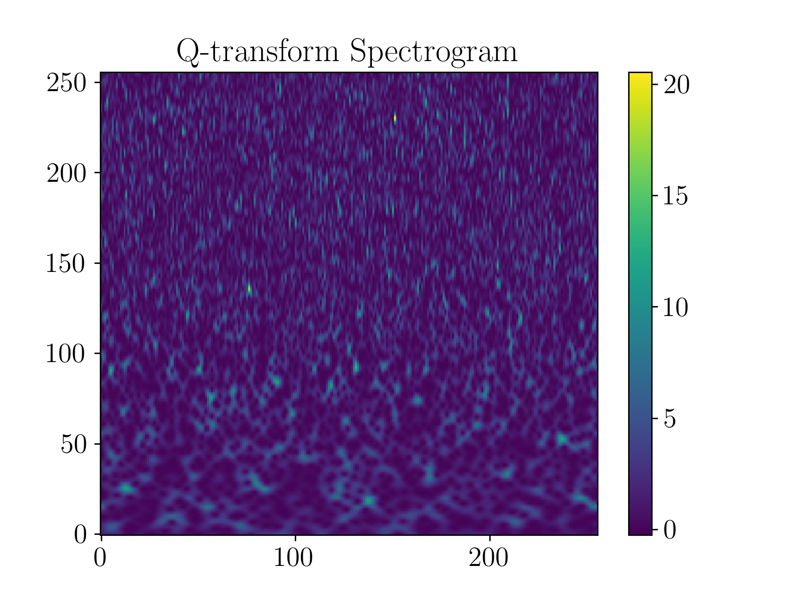

Q-transform
================

.. code-block:: python

   """
   Compute the Q-transform of a batch of time-series data.
   """

   from ml4gw.transforms import QScan
   import matplotlib.pyplot as plt
   import torch

   sample_rate = 2048
   duration = 10
   # Output shape of the spectrogram
   spectrogram_shape = [256, 256]

   qscan = QScan(
      sample_rate=sample_rate,
      duration=duration,
      spectrogram_shape=spectrogram_shape,
   )

   # Example data with shape (batch_size, channels, length)
   X = torch.randn(10, 2, duration * sample_rate)

   # Apply the Q-transform to compute the Q-transform of X
   spectrograms = qscan(X)

   # Plot the first spectrogram
   plt.imshow(spectrograms[0, 0], aspect='auto', origin='lower')
   plt.colorbar()
   plt.title('Q-transform Spectrogram')
   plt.show()

