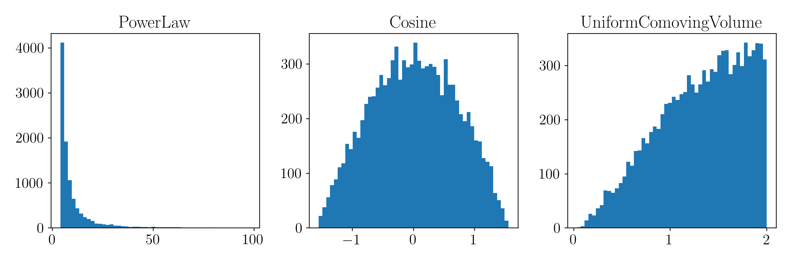

ml4gw package
=============

Subpackages
-----------

.. toctree::
   :maxdepth: 1

   ml4gw.dataloading
   ml4gw.nn
   ml4gw.transforms
   ml4gw.waveforms

Submodules
----------

ml4gw.augmentations module
--------------------------

.. automodule:: ml4gw.augmentations
   :members:
   :undoc-members:
   :show-inheritance:

.. rubric:: Example Usage

.. code-block:: python

   from ml4gw.augmentations import SignalInverter, SignalReverser
   import torch

   # Initialize augmentors with probability of applying the transformation
   inverter = SignalInverter(prob=0.25)
   reverser = SignalReverser(prob=0.5)

   # Example data with shape (batch_size, channels, length)
   X = torch.randn(10, 2, 1000)

   # Apply augmentations
   X = inverter(X)
   X = reverser(X)

ml4gw.distributions module
--------------------------

.. automodule:: ml4gw.distributions
   :members:
   :undoc-members:
   :show-inheritance:

.. rubric:: Example Usage

.. code-block:: python

   from ml4gw.distributions import PowerLaw, Cosine, UniformComovingVolume
   import matplotlib.pyplot as plt

   # Initialize distributions
   power_law = PowerLaw(
      minimum=4,
      maximum=100,
      index=-3,
   )
   cosine = Cosine()
   ucv = UniformComovingVolume(
      minimum=0,
      maximum=2,
      distance_type="redshift",
   )

   # Sample from distributions
   samples_power_law = power_law.sample((10000,))
   samples_cosine = cosine.sample((10000,))
   samples_ucv = ucv.sample((10000,))

   # Plot samples
   plt.figure(figsize=(12, 4))

   plt.subplot(1, 3, 1)
   plt.hist(samples_power_law, bins=50)
   plt.title("PowerLaw")

   plt.subplot(1, 3, 2)
   plt.hist(samples_cosine, bins=50)
   plt.title("Cosine")

   plt.subplot(1, 3, 3)
   plt.hist(samples_ucv, bins=50)
   plt.title("UniformComovingVolume")

   plt.tight_layout()
   plt.show()

ml4gw.gw module
---------------

.. automodule:: ml4gw.gw
   :members:
   :undoc-members:
   :show-inheritance:

.. rubric:: Example Usage

.. code-block:: python

   """
   Project a batch of waveform polarizations onto the Hanford,
   Livingston, and Virgo interferometers to compute the observed
   gravitational wave strain.
   """

   from ml4gw.gw import get_ifo_geometry, compute_observed_strain
   from ml4gw.distributions import Cosine
   from torch.distributions import Uniform

   dec = Cosine()
   psi = Uniform(0, torch.pi)
   phi = Uniform(-torch.pi, torch.pi)

   # Get the interferometer geometry
   ifos = ["H1", "L1", "V1"]
   tensors, vertices = get_ifo_geometry(*ifos)

   # The following assumes that the plus and cross polarizations
   # of the gravitational wave have already been computed by
   # some method; e.g., using the `TimeDomainCBCWaveformGenerator`
   # from the `ml4gw.waveforms` module. `sample_rate` is the sample
   # rate at which the polarizations were generated.
   waveforms = compute_observed_strain(
      dec=dec.sample((num_waveforms,)),
      psi=psi.sample((num_waveforms,)),
      phi=phi.sample((num_waveforms,)),
      detector_tensors=tensors,
      detector_vertices=vertices,
      sample_rate=sample_rate,
      cross=hc,
      plus=hp,
   )

.. code-block:: python

   """
   Compute the signal-to-noise ratio (SNR) of a batch of waveforms
   relative to a given noise power spectral density (PSD).
   """

   from ml4gw.gw import compute_network_snr

   # Assume `waveforms` is a batch of waveforms with shape
   # (num_waveforms, num_detectors, num_samples) and 
   # `psd` is a batch of power spectral densities. See the
   # docstring for details on the allowed PSD shapes.

   # Highpass determines the minimum frequency for the SNR calculation.
   highpass = 20

   # Sample rate of the waveforms
   sample_rate = 2048

   snr = compute_network_snr(
      responses=waveforms,
      psd=psd,
      sample_rate=sample_rate,
      highpass=highpass,
   )

ml4gw.spectral module
---------------------

.. automodule:: ml4gw.spectral
   :members:
   :undoc-members:
   :show-inheritance:

.. note::
   The contents of this module are typically accessed through the ml4gw.transforms module.
